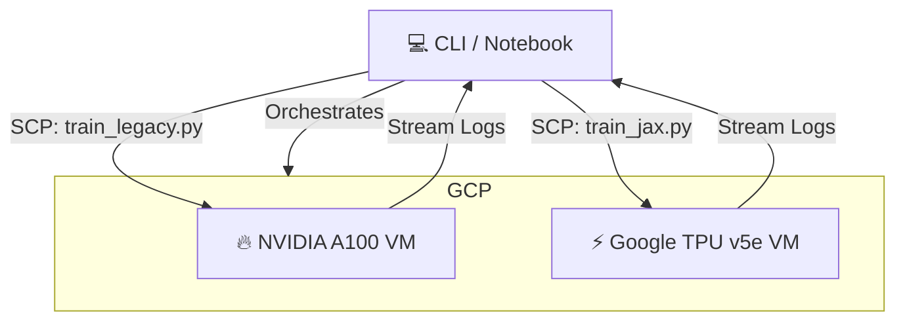

# 🚀 Ursa Major: The Accelerator Race
### CUDA to TPU Migration Demo

[]()
[]()
[](https://colab.research.google.com/github/UCR-Research-Computing/demo-cuda-to-tpu/blob/master/colab.ipynb)

**Ursa Major** is a live, interactive CLI demonstration that races a legacy **NVIDIA A100 GPU** against a modern **Google TPU v5e**. 

It simulates a real-world Research Computing workflow:
1.  **Legacy Code**: Taking an existing PyTorch/CUDA training loop (ResNet-50).
2.  **AI Refactoring**: Automatically converting it to a hardware-agnostic JAX/Flax model.
3.  **The Race**: Provisioning both accelerators simultaneously and racing them to convergence.

---

## ⚡ Quick Start

You can install and run this tool directly from your local machine (Linux/Mac) or Google Cloud Shell.

### Prerequisites
*   **Google Cloud SDK (`gcloud`)** installed and authenticated.
*   **Python 3.10+**

### Installing `uv`

If you don't have `uv` installed:

```bash
curl -LsSf https://astral.sh/uv/install.sh | sh
```

### Installation

```bash
uv tool install git+https://github.com/ucr-research-computing/demo-cuda-to-tpu
```

### Run the Demo

```bash
ursa-major-demo-cuda-to-tpu
```

### 🔄 Updating

To get the latest version of the demo:

```bash
uv tool upgrade demo-cuda-to-tpu
```

---

## 🏗️ Architecture

The tool acts as an **Orchestrator**. It does not run the heavy compute locally. Instead, it spins up ephemeral cloud resources to perform the work.



## 🧠 The Workload: ResNet-50

This benchmark trains a **ResNet-50** architecture on synthetic ImageNet data (224x224 RGB).

| Feature | Legacy (A100) | Modern (TPU v5e) |
| :--- | :--- | :--- |
| **Framework** | PyTorch (Eager) | JAX / Flax (XLA Compiled) |
| **Precision** | FP32 / AMP | bfloat16 (Native) |
| **Optimization** | Manual CUDA/cuDNN | XLA Compiler |
| **Throughput** | High | **Massive** |

## ☁️ Running in Google Colab

You can run this orchestrator from a Google Colab notebook to visualize the race without installing anything locally.

1.  Open a new Colab Notebook.
2.  Install the tool and authenticate:

```python
# 1. Install
!pip install uv
!uv tool install git+https://github.com/ucr-research-computing/demo-cuda-to-tpu --force

# 2. Authenticate (Pop-up will appear)
from google.colab import auth
auth.authenticate_user()

# 3. Configure Project
!gcloud config set project ucr-research-computing
!gcloud config set compute/zone us-central1-a

# 4. Run the Race!
!/root/.local/bin/ursa-major-demo-cuda-to-tpu
```

## 🧹 Cleanup

The tool attempts to auto-cleanup at the end of the run. If you interrupted it or something broke, run:

```bash
ursa-major-demo-cuda-to-tpu --cleanup
```

---
*Maintained by UCR Research Computing*
